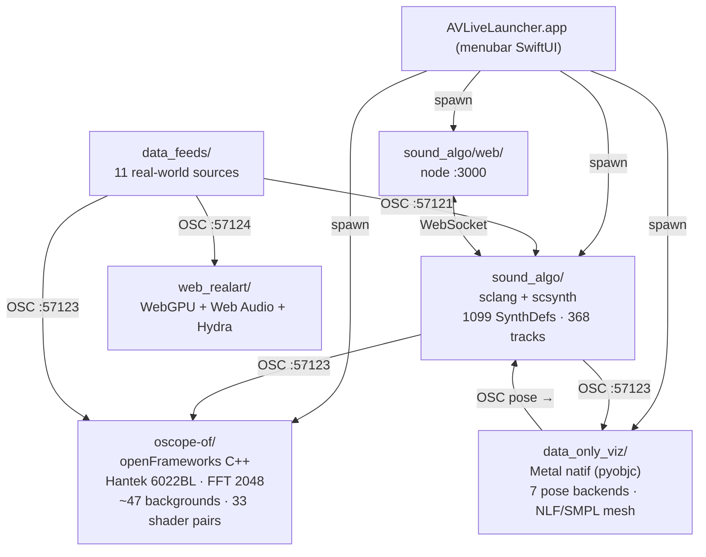
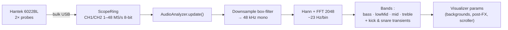
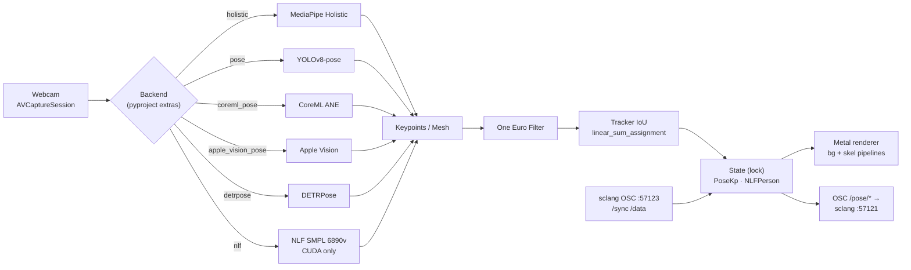

# AV-Live

> **Live coding audio-visual performance system** built around a SuperCollider sound engine, an openFrameworks oscilloscope visualizer driven by a real Hantek 6022BL USB scope, a macOS menubar launcher, and a Metal-native pose / body-mesh visualizer that listens to the same audio bus.
>
> 15 scripted demoparties · ~47 fullscreen visuals (26 3D parametric meshes + 18 procedural shaders + 3 dedicated C++ scenes) · 5 OS pixel-art shaders · 14 retro OS logos · 33 GLSL shader pairs (~65 files) · 1099 SynthDefs across 368 tracks (23 albums × 16) · **20 real-world data feeds** · 7 pose-estimation backends · **SMPL-X body mesh** (10 475 vertices via Multi-HMR + RealityKit) · **3 launch modes** (Full / Data-only / Body Mesh) — all reactive to the audio physically passing through the scope probes.

## Top-level architecture

ASCII (always renders):

```
                                  AV-LIVE
              ┌──────────────────────────────────────────┐
              │        AVLiveLauncher.app (menubar)      │
              └────┬────────────┬─────────────┬──────┬───┘
                   │            │             │      │
           ┌───────▼──────┐ ┌───▼────┐ ┌──────▼───┐ ┌▼────────────┐
           │ sclang +     │ │ node   │ │ oscope-of│ │ data_only_viz│
           │ scsynth      │ │ web ui │ │ (oF C++) │ │ (Metal py)   │
           │ sound_algo/  │ │ :3000  │ │ Hantek   │ │ webcam pose  │
           │ 1099 SynthDef│ │        │ │ FFT 2048 │ │ 7 backends   │
           │ 368 tracks   │ │        │ │ ~47 bg   │ │ NLF / SMPL   │
           └───────┬──────┘ └───┬────┘ └──────┬───┘ └───┬─────────┘
              :57121 OSC    :3000 HTTP    :57123 OSC      :57123 OSC out
                   │            │             ▲              │
                   └────────────┴─────────────┴──────────────┘
                                       ▲
                          data_feeds/ (11 sources OSC)
```

Mermaid (rendered on GitHub):



## Features

### 🎵 Sound engine — `sound_algo/`
- **1099 SynthDefs** auto-loaded (acid_v1..v19, bass808_v1..v19, lead_v1..v19, kicks, drums, world, fx, master) — 1059 synth + 40 fx confirmed
- **23 albums × 16 tracks = 368 tracks** ready to play (album letters A-W)
- **Subtle humanize** : timing ±3.5 ms, velocity ±10 %, micro-detune ±3 cents per note
- **Synth rotation** : cycles through 19 versions of each SynthDef every 8 notes
- **Auto layering** : 3 voice layers parallel to melody/harmony/acid
- **15 album signatures** with per-album palette, FX drives, layer config
- **OSC bridge** to oscope-of and data_only_viz on `:57123` (kick/snare/melody/lead/bass/bpm/album)
- **Web UI** on `:3000` with live coding control surface (Express + WebSocket bridge)
- **18 example scripts** in `sound_algo/examples/00..17_*.scd`

### 📺 Visualizer — `oscope-of/`
- **Hantek 6022BL** real USB oscilloscope capture (1–48 MS/s, 2 channels, 8-bit) via libusb bulk transfers
- **AudioAnalyzer** : downsamples Hantek to 48 kHz, FFT 2048 (~23 Hz/bin), bands bass / lowMid / mid / treble / kick / snare
- **~47 fullscreen backgrounds** (enum `BgKind` in `src/ofApp.h:98-113`, 53 enum values) :
  - **26 ModelVis 3D parametric meshes** : Möbius, Klein, trefoil, twisted torus, Lucy, helix, catenoid, Boys, lemniscate, Penrose, sphere, icosahedron, dodecahedron, torus, supershape, Lorenz attractor, Hopf, Enneper, Hopf link, gear, cone, pyramid, rose3D, geosphere, DNA helix, hyperboloid
  - **18 ShaderVis procedural** : metaballs, voronoi, twister bars, plasma FBM, rotozoom, truchet kaleido, SDF tunnel raymarched, KIFS fractal, fire, perspective grid, tunnel cubes, caustics, vortex, octahedron chrome, Boing ball, Mode7, plasma C64, dot tunnel
  - **3 dedicated C++ scenes** : TunnelVis, VectorCubesVis, SphereWaveVis
  - **+ starfield** (DemoFx) and **+ live webcam** (WebcamVis)
- **5 OS pixel-art shaders** : Workbench (Amiga), Mac OS Classic, Atari Fuji, Ocean Loader, Win95
- **14 OS logo PNGs** with demoscene FX (mirror reflection, ghost trail, RGB chroma, twister wobble, scanlines, glitch tear) : Win 1.0/3.11/95, Lotus 1-2-3, MS-DOS, Apple Rainbow, Amiga WB, NeXTSTEP, BeOS, OS/2 Warp, IRIX, ZX Spectrum, C64, Atari
- **10 scroller styles** : Classic, Wavy3D, Rainbow, Mirror, Glitch, Neon, Cascade, Chrome, Bouncy, Squashy
- **Demoscene FX** : sine scroller from `greetings.txt`, copper bars, logo bobs, starfield with motion blur
- **33 GLSL shader pairs (~65 files)** : 14 backgrounds + 5 OS pixel-art + 9 post-FX/transitions + 5 mesh/3D + shared utilities (`postfx.vert`, `transition.vert`), all GLSL 150 GL 3.2 core
- **Post-FX shader chain** : ACES tone-map, bloom, chromatic aberration, hue rotation, scanlines, vignette, grain, pixelate, kaleido, feedback FBO, glitch displacement

### 🤸 Pose / body mesh — `data_only_viz/` *(new)*
Metal-native fullscreen visualizer (pyobjc, MTKView, ~60 fps) driven by webcam pose detection. Listens to the same OSC bus as `oscope-of` (`:57123`) so audio sync and data feeds drive its shaders identically, **and** ships pose features back to `sound_algo` on `:57121` to close the loop (the dancer steers the synths).

- **7 pose backends** (drop-in via `pyproject.toml` extras) :

  | Backend | Module | Model | Status |
  |---------|--------|-------|--------|
  | MediaPipe Holistic | `holistic.py` | 33 body + 478 face + 42 hand kp | stable |
  | YOLOv8-pose | `pose.py` | Ultralytics, 17 COCO kp | stable (MPS) |
  | Apple Vision | `apple_vision_pose.py` | VNDetectHumanBodyPoseRequest (ANE) | macOS only |
  | Core ML pose | `coreml_pose.py` | YOLO11n-pose CoreML, AVCapture zero-copy | stable |
  | DETRPose | `detrpose.py` | DETR transformer, COCO 17 kp, multi-person | manual clone + ckpt |
  | NLF | `nlf_worker.py` | SMPL body mesh, 6890 vertices, TorchScript | **CUDA-only** (CPU/MPS bricked) |
  | MediaPipe multi | `multi.py` | Pose/Face/Hand ×4 personnes | stable |

- **Renderer** : Metal pipelines compiled at runtime (`shaders/*.metal`), `bg_pipeline` (full-screen FBM) + `skel_pipeline` (skeleton lines). SMPL face topology shipped as binary (`mesh_topology.py`) for RealityKit-compatible mesh rendering.
- **Tracker** : One Euro Filter on keypoints + IoU multi-person association (`scipy.linear_sum_assignment`, ByteTrack-like).
- **OSC out → sclang** `:57121` : `/pose/count`, `/pose/center`, `/pose/wrist`, `/pose/head`, `/pose/sho_span`, `/pose/limb_span`.
- **Thread-safe state** : `state.py` exposes `State.lock()` ; dataclasses `PoseKp`, `NLFPerson` (vertices_3d, joints_3d), and a multi-person container.

### 🎬 Demoparties — 15 narrative demos
Each demoparty is a multi-act scripted show with unique scroller text, background sequence, scroller style, and SuperCollider album track :

| Key | Demo | Acts | Album |
|-----|------|------|-------|
| `1`/`&` | AMIGA TRIBUTE | 6 | M chiptune_madness |
| `2`/`é` | C64 LOWLIFE | 5 | N phonk |
| `3`/`"` | ACID JOURNEY | 8 | A acid_journey |
| `4`/`'` | TUNNEL VISION | 5 | P industrial |
| `5`/`(` | FREQUENCIES | 7 | I liquid_dnb |
| `6`/`§` | GLITCH WORLD | 6 | V glitch_idm |
| `7`/`è` | AMBIENT VOID | 7 | J ambient_cinematic |
| `8`/`!` | RAVE | 7 | T hardcore_gabber |
| `9`/`ç` | MEMORY LANE | 8 | U vocal_trance |
| `0`/`à` | GREETINGS | 18 | W dub_techno |
| `F6` | FRACTAL DREAMS | 7 | O asian_cinematic |
| `F7` | INFERNO | 6 | E vietnam_hard |
| `F8` | OUTRUN | 6 | R synthwave |
| `F9` | CUBE STORM | 8 | Q neurofunk_dnb |
| `F10` | GRAND FINAL | 8 | L future_garage |

Each act lasts 12–55 s, transitions between acts trigger flash + glitch postfx + audio swap. Demos loop on their first act after the last.

### 🎛 Live FX control (Mac AZERTY FR friendly)
- `a z e r t y u i o p` — 10 background scenes (BoingBall, Tunnel, Metaballs, Voronoi, Twister, KIFS, Fire, Mode7, Octahedron, PlasmaC64)
- `s d f g h j k l m` + `w x c v b n , ;` — 17 FX parameters (speed, kick, roll, pan, curve, tile X/Z, dir lerp, bloom, chroma, kaleido, scanlines, pixelate, hue, grain, vignette, saturation)
- `↑ ↓` — adjust selected parameter (× 1.20 / × 0.83 multipliers, or ± 0.05 absolute)
- `:` — reset all FX
- `\` or `*` — toggle beat-sync (queue demo trigger to next kick)
- `q` / `Esc` — exit narrative, default to SphereWave 3D live background
- `Espace` — manual glitch pulse
- `F1`–`F5` — fullscreen / GUI / postFx / autoglitch / reload shaders

### 🌐 Real-world data feeds — `data_feeds/` + `web_realart/` + `data_only_viz/web/`
- **20 feed modules** in `data_feeds/feeds/` ingested by `bridge.py` and broadcast as OSC `/data/<source>/<sub>` to SC (`:57121`), oF (`:57123`) and the web bridge (`:57124`) :
  - **Geophysique** : USGS quakes · Smithsonian GVP volcanoes · Blitzortung lightning
  - **Meteo / Air** : Open-Meteo (temp/wind/rain) · OpenAQ (PM2.5/PM10/NO2/O3)
  - **Espace** : NOAA SWPC (solar wind, Bz IMF, Kp, X-ray) · ISS position (wheretheiss.at) · GCN astrophysics
  - **Mobilite** : OpenSky ADS-B · LiveATC listeners
  - **Energie / reseau** : Mainsfrequenz.de · RTE eCO2mix · NOAA tides + moon phase
  - **Social / numerique** : Bluesky firehose · Reddit /r/all + HackerNews top · Wikipedia EventStream · GDELT 2.0 events · GitHub · Bitcoin mempool
  - **Pose / webcam** : YOLOv8-pose
- **SC presets** `sound_algo/examples/16_data_feeds.scd` and `17_data_feeds_more.scd` map each source to synthesis : Schumann cavity drone (foudre), aurora additive pad (Bz/wind/Kp), Netzfrequenz pulse kick, RTE 8-op carbon FM, OpenSky granular swarm
- **Web standalone** `web_realart/` ports the visualizers and synths to the browser for `real.art.saillant.cc` :
  - **WebGPU + three.js TSL** (r171) globe with quake/strike/flight particles (auto-fallback WebGL2)
  - **Web Audio** ports of 5 SC SynthDef presets (cavity, mix, geo, aurora, pulse)
  - **Hydra** with 7 data-driven patches (aurora, quake, lightning, flightmap, gridpulse, solarwind, bskyrain)
  - All three layers share `feeds_client.js` (`window.feeds`) over one WebSocket

- **Web data-only** `data_only_viz/web/` (port `:3211`, Express + WebSocket) — **bidirectional** OSC bridge for the Data-only mode :
  - **`/dashboard.html`** — live cards + SVG sparklines for all 19 active feeds (USGS, GDELT, Wiki, ISS, tides + moon, ATC, ...) with severity classes (alert / warn / green)
  - **`/map.html`** — Leaflet dark fullscreen with markers ephemeres for geocoded feeds (quakes, lightning, planes, volcanoes, GDELT events) + persistent ISS marker
  - **`/control.html`** — 3-pane control surface : 7 synth/mix sliders (master, cutoff, reso, reverb, delay, tempo), 10 audio scene buttons (`/scene/play`), 9 visual mode buttons routed to oF (`/control/vizMode` → `:57123`), XY pad (`/xy/{x,y}`)
  - **SC retour** : `sound_algo/control/web_bridge.scd` listens on `:57121` for `/control/*` `/scene/*` `/xy/*` and pushes `/sync/bpm|beat|rms|voices` to web on `:57125` at 4 Hz

### 📡 Audio reactivity pipeline

ASCII :

```
Hantek probes → bulk USB → ScopeRing CH1/CH2 (1-48 MS/s, 8-bit)
                                ↓
                        AudioAnalyzer.update()
                                ↓
                    Downsample box-filter → 48 kHz mono
                                ↓
                  Hann window + FFT 2048 (23 Hz/bin)
                                ↓
        bands : bass(20-200) / lowMid(200-800) /
                mid(800-3200) / treble(3200-16000) /
                kick (transient bass) / snare (transient mid+treble)
                                ↓
                    drives every visualizer parameter
```

Mermaid :



### 🤸 Pose pipeline — `data_only_viz` *(new)*



## Quick start

### macOS install

```bash
# 1. Clone
git clone https://github.com/electron-rare/AV-Live.git
cd AV-Live

# 2. Dependencies
brew install --cask supercollider
brew install libusb node uv
# openFrameworks 0.12 : https://openframeworks.cc/download/  (extract to ~/of)

# 3. Build the launcher (universal binary arm64+x86_64)
cd launcher && bash build.sh

# 4. Build oscope-of (one-time symlink for oF make)
ln -s "$PWD/../oscope-of" ~/of/apps/myApps/oscope-of
cd ~/of/apps/myApps/oscope-of
make OF_ROOT=$HOME/of -j4 Release

# 5. (optional) data_only_viz Metal pose viz
cd ../../../data_only_viz
uv sync                       # base (Metal + OSC + tracker)
uv sync --extra pose          # + MediaPipe / YOLOv8 / Ultralytics
# uv sync --extra nlf         # + NLF SMPL body mesh (CUDA only)
uv run python -m data_only_viz.main

# 6. Run the whole stack
open AV-Live/launcher/build/AVLiveLauncher.app
```

The launcher autostarts `sclang` + the relevant visualizers + the web bridges depending on the **3 launch modes** offered by the picker at startup :

- **Full AV-Live** — sclang + oscope-of + sound_algo web UI (`:3000`) + data_feeds (full profile)
- **Data-only** — sclang + `data_only_viz` Metal viz + data_feeds (data-only profile) + sound_algo web UI + **data-only dashboard** (`:3211` with `/dashboard.html`, `/map.html`, `/control.html`)
- **Body Mesh** — sclang + `data_only_viz` (headless, Multi-HMR worker only) + **`AVLiveBody`** Swift app (RealityKit, SMPL-X mesh + webcam overlay + live `RenderSettings` panel `S`) + data_feeds + dashboard data-only

Open the menubar icon for per-process Start/Stop, logs, and the "AV-Live-Body" launch button available from any mode.

### Without Hantek hardware

`oscope-of` works without the scope plugged in. It falls back to synthesized signals from the OSC `/sync/*` metadata sent by `sound_algo`. You lose the audio-derived FFT but the demoscene visuals + narrative demos all still play. `data_only_viz` runs identically since it only needs the OSC bus + a webcam.

## Demoparty mode

Press a digit (1–9, 0) or F-key (F6–F10) to launch a 1–3 minute scripted demoparty. Each one is a journey through audio + visual transitions, with greetings to the demoscene legends along the way (Fairlight, Razor 1911, ASD, Conspiracy, Farbrausch, TBL, Mercury, TPOLM, Loonies, Hokuto Force, IQ, Knighty, Smash, Gargaj…).

The `0` GREETINGS demo cycles through 18 acts including Boing Ball, plasma C64, dot tunnel, twister bars, copper bars, fractal KIFS, Möbius topology, then a parade of OS logos (Win 1.0, Lotus 1-2-3, Atari, Apple, OS/2 Warp, IRIX, ZX Spectrum), ending on a roll call of demoscene groups.

## Architecture details

| Component | Path | Tech |
|-----------|------|------|
| Sound engine | `sound_algo/` | SuperCollider 3.14+, ~12k LOC `.scd` |
| Sound web UI | `sound_algo/web/` | Node Express + WebSocket bridge OSC↔HTTP |
| Visualizer | `oscope-of/` | openFrameworks 0.12, GLSL 150 GL 3.2 core, ~6k LOC C++ |
| Pose / body mesh | `data_only_viz/` | Python 3.11+ / `uv`, Metal natif via pyobjc, 7 pose backends |
| Launcher | `launcher/` | SwiftUI universal app, sentinel-based restart, ProcessManager `@MainActor` |
| Real-world feeds | `data_feeds/` | Python `uv`, 20 async feed modules, `bridge.py` OSC fan-out (3 targets) |
| Data-only web | `data_only_viz/web/` | Node Express `:3211` + WS bidir bridge OSC, dashboard / map / control |
| Body mesh app | `launcher/AV-Live-Body/` | Swift 6 + RealityKit, SMPL-X 10 475 verts, LowLevelMesh + wireframe |
| Multi-HMR worker | `data_only_viz/multi_hmr_worker.py` | PyTorch MPS, AVCaptureSession native, TCP sender :57130 |
| Web standalone | `web_realart/` | Node Express + ws, WebGPU three.js r171 + Web Audio + Hydra |
| Audio FFT | `oscope-of/src/AudioAnalyzer.{h,cpp}` | downsample + Hann + FFT 2048 |
| 3D models | `oscope-of/bin/data/models/` | 27 PLY parametric meshes |
| Sprites | `oscope-of/bin/data/sprites/` | 14 PNG OS logos + 5 SVG sources |
| Shaders | `oscope-of/bin/data/shaders/` | 33 GLSL pairs (~65 files) frag+vert |
| Metal shaders | `data_only_viz/shaders/` | `.metal`, runtime-compiled |

OSC ports : `scsynth :57110` · `sclang :57121` · `node web :57122` · `oscope-of :57123` (source: `oscope-of/bin/data/settings.json`) · `web_realart :57124` · `http :3000`.

## License

GPL-3.0-or-later. See [`LICENSE`](LICENSE).

## Credits & homages

Built by **L'Électron Rare** (Clément Saillant). Greetings to all the live coders, the demoscene legends, the openFrameworks community, the SuperCollider community, the Saillans festival 2026 artists, and everyone keeping the phosphor alive.

The GREETINGS scroller in `oscope-of/bin/data/sprites/greetings.txt` is the soul of the project — edit it freely and make it yours.

```
*** Press 1-0 + F6-F10 to start a demoparty ***
*** Keep the scene alive — 1985 to ∞ ***
```
